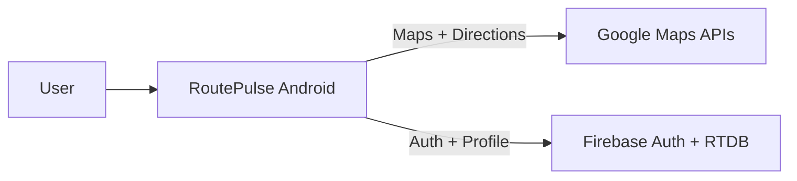
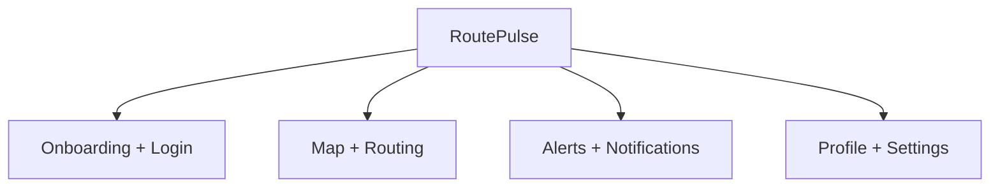

# RoutePulse Android

<div align="center">
  
</div>

<p align="center">
  
  
  
  
  
  
</p>

<p align="center"><strong>RoutePulse</strong> — Live traffic, fuel stops, and safer routes.</p>

Built by Shashank Preetham Pendyala

---

## Overview

RoutePulse is a traffic intelligence Android app that blends live maps, route planning, and fuel-station discovery into a single, driver-first experience. It uses Google Maps + Directions APIs for routing and Firebase for identity and profile data.

Success is measured by:
- Time-to-route after launch
- Accuracy of traffic delay summaries
- Fuel stop discovery relevance
- Crash-free sessions and UI responsiveness

---

## Table of Contents

- [Features](#features)
- [Architecture](#architecture)
- [Layered Architecture](#layered-architecture)
- [Module Inventory](#module-inventory)
- [Tech Stack](#tech-stack)
- [Project Structure](#project-structure)
- [Key Flows](#key-flows)
- [Data Model Summary](#data-model-summary)
- [Environment Variables](#environment-variables)
- [Setup and Run](#setup-and-run)
- [Run, Build, Test](#run-build-test)
- [Configuration](#configuration)
- [Security Notes](#security-notes)
- [Troubleshooting](#troubleshooting)
- [Roadmap](#roadmap)
- [License](#license)

---

## Features

### Core

- Onboarding flow with live feature highlights
- Email/password auth (Firebase Auth)
- Live maps with current location and destination search
- Route alternatives with traffic delay summaries
- Nearby fuel discovery (CNG, petrol, gas, diesel)
- Alerts feed with traffic/fuel insights
- Profile, notifications, privacy, and language settings
- Subscription prompt + review dialog

### Safety & Utility

- Emergency dial shortcut
- GPS permission assistant screen
- Cached routes/alerts for faster reloads

---

## Architecture

### System Overview



### Client Modules View



---

## Layered Architecture

### UI Layer

- XML + Material 3
- Custom palette, typography, and shapes
- Map overlay controls + bottom nav

### Data Layer

- Firebase RTDB for user profile and settings
- Cached lists for routes and alerts

### Domain Layer

- Location permissions + map state
- Routing, fuel station search, and alerts orchestration

---

## Module Inventory

### Activities and Fragments

- `OnboardingActivity`, `LoginActivity`, `SignUpActivity`
- `MainActivity` (bottom nav container)
- `HomeFragment` (map, routing, fuel)
- `AlertsFragment` (alerts feed)
- `ProfileFragment` (profile + settings)

### Utilities

- `NotificationHelper` (alerts)
- `GeoApiContextHolder` (Maps + Directions)

---

## Tech Stack

- Android: Java, AndroidX, Material 3
- Maps: Google Maps SDK, Directions API, Places API
- Firebase: Auth, Realtime Database, Storage
- UI: Lottie, Material Components

---

## Project Structure

- `app/src/main/java/com/routepulse/app/` core app
- `app/src/main/res/` layouts, drawables, themes
- `app/src/androidTest/` instrumentation tests
- `app/src/test/` unit tests

---

## Key Flows

### Routing Flow

1. User enters current location and destination
2. Directions API returns alternatives with traffic delays
3. Route overview + fuel stops displayed

### Alerts Flow

1. Alerts feed aggregates traffic/fuel updates
2. Cached alerts show instantly on re-open

---

## Data Model Summary

Core entities:
- User profile + preferences
- Cached traffic alerts
- Fuel station lists by type
- Route summaries + delays

---

## Environment Variables

- `google_maps_key` in `strings.xml`
- `default_web_client_id` in `strings.xml`

---

## Setup and Run

### Prerequisites

- Android Studio (latest stable)
- JDK 17
- Firebase project + Maps API key

### Quick Start

1. Open project in Android Studio
2. Replace `google-services.json` with your Firebase config
3. Update `google_maps_key` in `strings.xml`
4. Sync Gradle and run on device/emulator

---

## Run, Build, Test

```bash
./gradlew assembleDebug
./gradlew test
```

---

## Configuration

- Theme tokens: `res/values/colors.xml`, `res/values/themes.xml`
- App name: `res/values/strings.xml`
- Manifest setup: `AndroidManifest.xml`

---

## Security Notes

- Never commit real production keys in public repos
- Use restricted API keys in Google Cloud Console

---

## Troubleshooting

- If build fails, run `./gradlew clean` and resync
- If maps fail, validate API key + billing status
- If auth fails, verify Firebase project configuration

---

## Roadmap

- Offline routing cache
- Push notifications for traffic spikes
- Fuel price tracking

---

## License

MIT License. See LICENSE if included.
